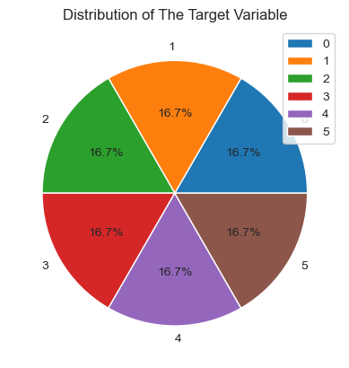
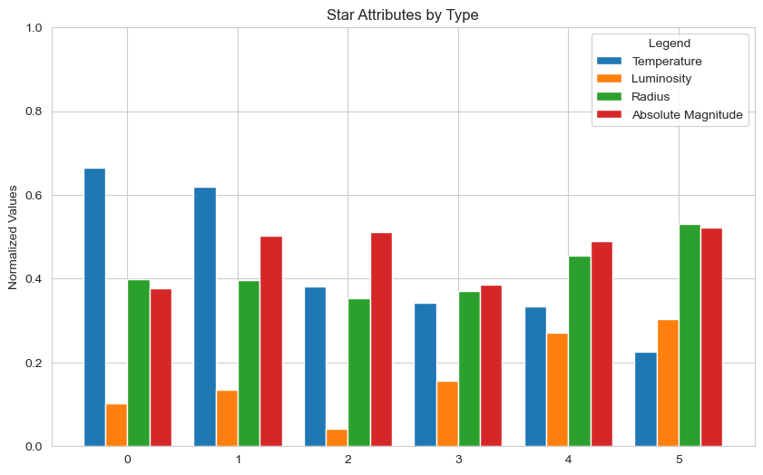
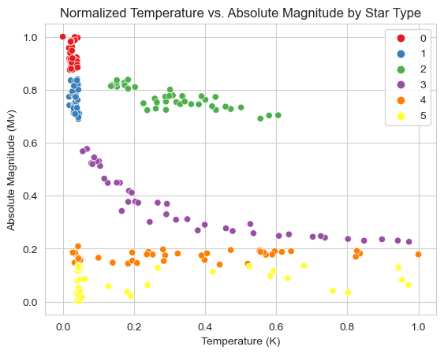
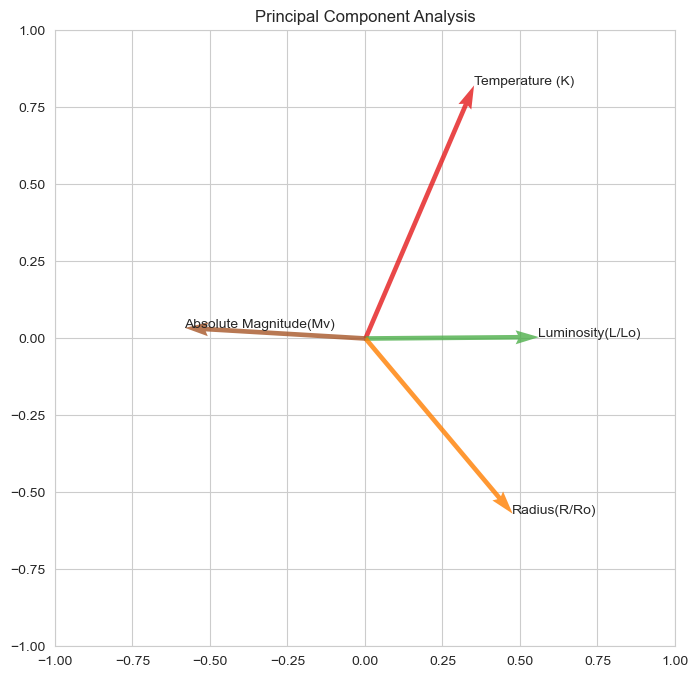
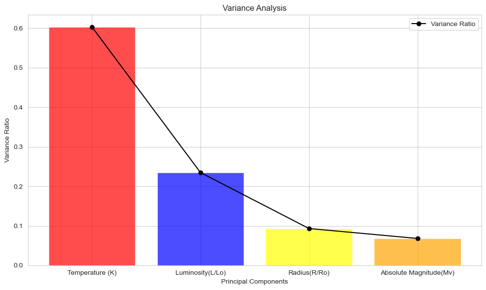
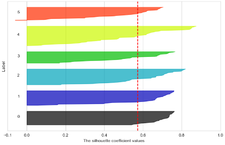
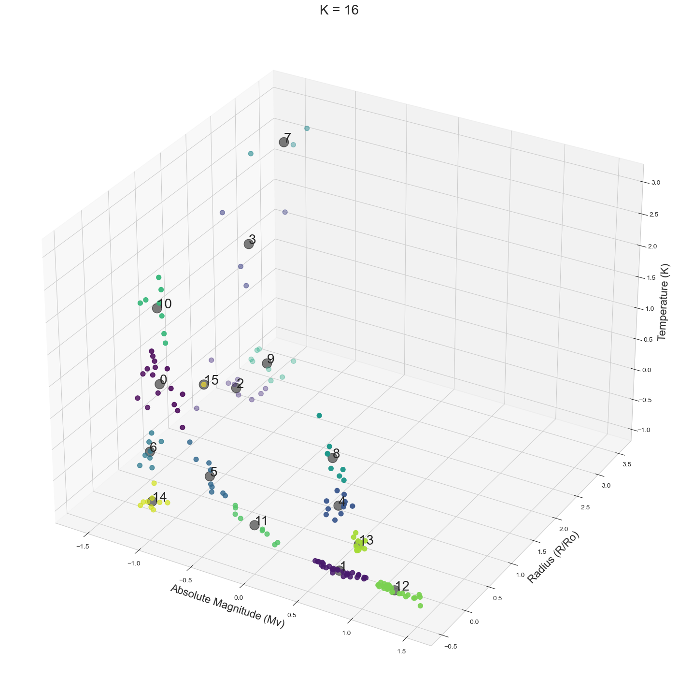

# StarryNight

## Membri del gruppo
- 902011, Moleri Andrea, a.moleri@campus.unimib.it
- 856114, Costantini Davide, d.costantini6@campus.unimib.it
- 865939, Armani Filippo, f.armani1@campus.unimib.it

## Descrizione del Dominio di Riferimento e Obiettivi
Il progetto StarryNight si propone di sviluppare un sistema di classificazione di corpi celesti mediante l'impiego di 3 modelli: gli alberi decisionali, le reti neurali e il clustering. L’obiettivo primario è di dimostrare che le stelle sono divisibili in classi, come già teorizzato dal diagramma di Herzsprung-Russell (Diagramma HR) al quale la nostra ricerca si appoggia. Tale diagramma costituisce la base per classificare le stelle tracciando le loro caratteristiche, fornendo così informazioni sulle loro proprietà.

## Scelte di Progettazione per la Creazione del Dataset, Ipotesi e Assunzioni

Nella creazione del dataset, assumiamo che le stelle mostrino pattern identificabili nelle loro caratteristiche, consentendo una classificazione significativa. Il Diagramma HR sarà utilizzato come linea guida per il sistema di classificazione. Il dataset comprenderà una serie di caratteristiche cruciali per la classificazione:

- **Absolute Temperature**: la temperatura assoluta di un corpo celeste, indicata dal simbolo $T$, viene misurata in Kelvin $K$. Rappresenta la temperatura del corpo sulla scala Kelvin, una scala di temperatura assoluta dove $0K$ corrisponde allo zero assoluto, la teorica temperatura più bassa possibile. La temperatura assoluta è un parametro fondamentale in astrofisica ed è cruciale per comprendere le caratteristiche termodinamiche degli oggetti celesti.

- **Relative Luminosity**: la luminosità relativa, espressa come $L/L_o$, indica il rapporto tra la luminosità di un corpo celeste ($L$) e la luminosità solare ($L_o$). La luminosità è la quantità totale di energia irradiata dall'oggetto per unità di tempo. Questa quantità fornisce informazioni sulla luminosità intrinseca di un corpo celeste rispetto al Sole.

- **Relative Radius**: il raggio relativo, indicato da $R/R_o$, rappresenta il rapporto tra il raggio di un corpo celeste ($R$) e il raggio solare ($R_o$). Questo parametro è essenziale per caratterizzare le dimensioni degli oggetti celesti, facilitando il confronto delle loro dimensioni fisiche rispetto al Sole, che funge da riferimento standard.

- **Absolute Magnitude**: la magnitudine assoluta ($Mv$) è una misura della luminosità intrinseca di un oggetto celeste come apparirebbe se posto a una distanza standard di $10$ parsec da un osservatore. Questo parametro è definito su scala logaritmica. La magnitudine assoluta consente agli astronomi di valutare la vera luminosità dei corpi celesti indipendentemente dalle loro distanze dalla Terra.

- **Star Color**: questo termine si riferisce alla percezione visiva dell'alone di un oggetto celeste osservato dalla Terra. Questa caratteristica qualitativa è attribuita alle lunghezze d'onda dominanti emesse dalla superficie della stella. Colori comuni includono bianco, rosso, blu, giallo e giallo-arancio. L'analisi del colore della stella fornisce informazioni preziose sulla temperatura e composizione degli strati esterni di una stella.

- **Spectral Class**: la classe spettrale categorizza le stelle in base alle loro caratteristiche spettrali, principalmente determinate dalla temperatura delle loro superfici. La sequenza spettrale, dal più caldo al più freddo, è indicata dalle lettere $O$, $B$, $A$, $F$, $G$, $K$ e $M$. Questo sistema di classificazione aiuta gli astronomi a classificare le stelle e a comprendere le loro proprietà fondamentali, come temperatura, luminosità e composizione chimica.

- **Star Type**: il tipo di stella si riferisce alla categorizzazione degli oggetti celesti in base alla loro fase evolutiva e alle caratteristiche fisiche. Questa classificazione include:
  - Nane Rosse, stelle a bassa massa e lunga durata di vita;
  - Nane Brune, oggetti sub-stellari non abbastanza massicci da sostenere la fusione nucleare;
  - Nane Bianche, residui di stelle a bassa o media massa;
  - Stelle della Sequenza Principale, come il nostro Sole, che stanno subendo la fusione dell'idrogeno;
  - Supergiganti, stelle massicce e luminose;
  - Ipergiganti, le stelle più massicce e intrinsecamente luminose nella gerarchia stellare.
  Comprendere i tipi di stelle è cruciale per comprendere i diversi cicli di vita delle stelle nell'universo.

Il target per la classificazione sarà la classe "Star Type". 

Si applicano le seguenti definizioni:

- $(L_o = 3.828 * 10^{26} Watts)$: Luminosità Media del Sole
- $(R_o = 6.9551 * 10^8 m)$: Raggio Medio del Sole

## Formattazione e Analisi dei Dati
Il processo inizia eseguendo una fase di formattazione preliminare del dataset per assicurarsi che tutte le istanze considerate abbiano valori corretti e ben formattati, in quanto si è osservato, soprattutto per i dati relativi al colore, che valori uguali fossero memorizzati in maniera diversa (maiuscole/minuscole e utilizzo di spazi e trattini). Successivamente, avviene la conversione della colonna target in tipo categorico, in quanto questo permette l'esecuzione di alcune operazioni e migliora le prestazioni nelle operazioni e nell'addestramento del modello.

Dopodiché vengono verificate le dimensioni e le principali caratteristiche del dataframe e, terminata questa fase, ci concentriamo sulla comprensione della distribuzione dei valori all'interno di ciascuna classe target tramite l'utilizzo di un grafico a torta.

I valori all'interno delle classi target si distribuiscono uniformemente, indicando un campionamento bilanciato nel dataset.

Al termine di questa fase è stata eseguita un ulteriore esplorazione attraverso un grafico a barre su valori normalizzati, concentrandoci sul tipo di stella come classe target. Tramite il grafico, è possibile visualizzare tutte le caratteristiche numeriche degli attributi in relazione al tipo di stella, offrendo un'idea della loro distribuzione. Si denota che certi attributi, in particolare “Temperature”, sono ben distinti in base alle tipologie di stella ai quali appartengono. Questo sarà da tenere in considerazione nelle scelte di lavorazione dei dati future, in quanto permetterà una separazione lineare più agevole in fase di classificazione

Dopo varie sperimentazioni iterative, utilizziamo uno scatter plot per visualizzare la coppia di attributi con la migliore separabilità lineare possibile. In particolare, identifichiamo "Temperatura (K)" e "Magnitudine Assoluta (Mv)" come attributi ottimali a questo scopo nel dataframe. Il grafico conferma che non è necessario rimappare lo spazio attributi esistente in uno nuovo, poiché gli attributi selezionati catturano già efficacemente la separazione lineare desiderata.

Infine, procediamo alla fase di Analisi delle Componenti Principali, iniziando con l'Analisi della Varianza e ottenendo i seguenti risultati.

Al termine di questa fase sono sorte le seguenti considerazioni:

- Temperature ($K$): un rapporto di varianza di circa 0.6 indica una varianza moderata rispetto alla popolazione di riferimento. Ciò potrebbe suggerire che le temperature stellari nel dataset sono relativamente omogenee, ma sono comunque presenti differenze significative.
- Luminosity ($L/L_o$): un rapporto di varianza di circa 0.2 indica una varianza inferiore rispetto alle temperature, ma ciononostante l'attributo è comunque utile ai fini della classificazione. Le luminosità delle stelle nel dataset sembrano essere più omogenee rispetto alle loro temperature.
- Radius ($R/R_o$): un rapporto di varianza di circa 0.1 suggerisce una bassa varianza rispetto alla popolazione di riferimento per il raggio stellare. Ciò potrebbe indicare che il raggio delle stelle nel dataset è relativamente simile tra loro.
- Absolute Magnitude ($Mv$): un rapporto di varianza di circa 0.05 indica una varianza molto bassa rispetto alla popolazione di riferimento. Ciò suggerisce che le magnitudini assolute delle stelle nel dataset sono molto simili tra loro.

Alla luce di queste considerazioni, riteniamo che una riduzione della dimensionalità del dataset non sia giustificata. Gli attributi numerici attualmente a nostra disposizione mostrano una capacità descrittiva e una non ridondanza adeguate nel rappresentare le caratteristiche della classe target. Di conseguenza, è stata presa la decisione di evitare l'implementazione della fase di rimozione dell'analisi delle componenti principali in questo caso e di procedere con la classificazione.

## Creazione di set di addestramento e test
Prima di procedere con l'implementazione dei diversi modelli, si esegue una fase di suddivisione del dataset in due sottoinsiemi principali: il set di addestramento (training set) ed il test set.

## Primo Approccio: Alberi Decisionali
La decisione di adottare un modello di Albero Decisionale è guidata da diverse ragioni, tra cui:

- La capacità degli Alberi Decisionali di gestire i dati in modo diretto li rende particolarmente adatti alla natura diversificata delle caratteristiche nel dataset.  
- La semplicità degli Alberi Decisionali conferisce un ulteriore vantaggio in termini di efficienza computazionale. Questa caratteristica riveste particolare importanza nel contesto di dataset astronomici, dato che la dimensione di tali dataset è destinata a crescere nei prossimi anni.  
- Inoltre, gli Alberi Decisionali permettono di ottenere una struttura piuttosto robusta e adatta per accogliere dati futuri.

Per la creazione del modello si è deciso di mantenere un random state fisso (`random_state=42`) per garantire la riproducibilità dei risultati. L'albero decisionale ottenuto al termine della fase di training presenta `11` nodi, di cui `6` nodi foglia.

Per una valutazione preliminare del modello, abbiamo scelto di esaminare la matrice di confusione, fornendo al modello il test set e confrontando le etichette effettive (`y_test`) con quelle predette (`y_pred`). In tutte le analisi condotte, l'albero decisionale ha costantemente dimostrato un tasso di correttezza del `100%`.

## Secondo Approccio: Reti Neurali
Motivati da diversi fattori, abbiamo scelto di adottare un Modello a Rete Neurale per la classificazione di corpi celesti. Durante la fase di analisi preliminare, è emersa la chiara separabilità lineare tra le Classi del Dataset. Questo, unito alla capacità intrinseca delle reti neurali di riconoscere autonomamente pattern nei dati si rivela cruciale, soprattutto considerando le complesse strutture presenti nei dataset riguardanti le stelle. Inoltre, la flessibilità delle reti neurali nell'adattarsi a diversi tipi di dati risulta vantaggiosa per gestire la varietà degli attributi presenti nel nostro dataset. Siamo convinti che il nostro modello possa identificare pattern con maggiore precisione rispetto a modelli più semplici.

Un aspetto rilevante è la capacità di generalizzazione di una rete neurale ben addestrata, caratteristica che consente previsioni accurate anche per stelle non presenti nel set di addestramento, purché condividano somiglianze con il dataset di addestramento. Questo aspetto si rivela particolarmente utile, dato che i dati astronomici si ampliano costantemente nel tempo. Inoltre, la scalabilità dei modelli neurali con un aumento del volume dei dati contribuisce ulteriormente a migliorarne le prestazioni, rendendoli particolarmente vantaggiosi quando si dispone di set di dati più ampi.

Per ottenere il modello, inizialmente viene istanziato un oggetto `Sequential`. Il modello è costruito aggiungendo strati densi (totalmente connessi) con configurazioni specifiche. Il primo strato densamente connesso ha 3 unità e utilizza la funzione di attivazione Rectified Linear Unit (ReLU). Questo strato riceve un input di dimensione 4, come specificato dal parametro `input_shape`. Il secondo strato densamente connesso ha 6 unità e utilizza la funzione di attivazione softmax. Softmax è comunemente impiegato nell'ultimo strato di una rete neurale per problemi di classificazione multiclasse, convertendo l'output in una distribuzione di probabilità su più classi. Successivamente, il modello viene compilato. La funzione di perdita è impostata su `categorical_crossentropy`, adatta per problemi di classificazione multiclasse. Per aggiornare i pesi della rete, è stato scelto l'ottimizzatore Adam, e la metrica di valutazione è l'accuratezza, che misura la percentuale di previsioni corrette.

Durante la fase di addestramento, per scopi puramente estetici, è stato utilizzato il Callback di TensorFlow ai fini di visualizzare il progresso dell'addestramento in una singola riga, anziché in un formato esteso, che avrebbe occupato una parte significativa del notebook senza fornire valore aggiuntivo. In questo formato, il numero di epoche utilizzato per addestrare il modello viene riportato, seguito dai valori di accuratezza del modello.

Il modello e le singole epoche vengono valutate in base ai valori "Test Loss" e "Test Accuracy". I risultati ottenuti sono variabili, dipendendo molto dalla suddivisione tra training e test set, ma presentano un tasso d'accuratezza medio tra il 95% e il 98%. Questa variabilità potrebbe essere un fattore negativo in quanto indice di overfitting/underfitting. Gli errori in fase di classificazione sono dovuti al fatto che alcune classi non siano completamente separabili a causa di alcuni valori di alcuni attributi simili tra loro.

## Terzo Approccio: Clustering
La scelta di utilizzare un Modello di Clustering per la classificazione delle stelle ha molteplici motivazioni. In primo luogo, abbiamo notato una netta separazione nello spazio per la maggioranza delle classi, agevolando così un raggruppamento per cluster. Inoltre i modelli di clustering eccellono nell'identificare strutture visive, rendendoli particolarmente utili nella separazione delle caratteristiche del dataset. L'applicazione di modelli di clustering offre anche vantaggi in scenari in cui il dataset evolve continuamente, come nel caso dell'espansione dei dati astronomici. Categorizzando le stelle in base alle caratteristiche condivise, il modello di clustering è in grado di fare previsioni accurate per stelle non esplicitamente presenti nel set di addestramento ma che condividono somiglianze con quelle all'interno del dataset. Man mano che il volume dei dati astronomici cresce, il modello di clustering può facilmente incorporare nuovi dati nei cluster esistenti.

In questo approccio, abbiamo considerato solo le caratteristiche "Absolute Magnitude (Mv)", "Radius (R/Ro)" e "Temperature (K)" estratte dai dataset di addestramento e di test. Questa scelta è stata motivata dalla performance ridotta del classificatore nell'utilizzo della "Luminosity (L/Lo)", la cui distribuzione dei valori ha impattato negativamente sulle prestazioni. Abbiamo provveduto ad istanziare ed adattare il clustering K-Means per ogni valore di k, specificando uno stato casuale e 10 inizializzazioni. L'inerzia, misurando la somma dei quadrati delle distanze all'interno del cluster, è stata registrata per ciascun k e i risultati sono stati visualizzati nel grafico.

Per individuare il valore ottimale di `k` per il classificatore, abbiamo utilizzato il metodo del gomito (elbow method). Abbiamo esaminato la gamma di valori per il numero di cluster (`k`) da `5` a `20`, valutando l'inerzia dell'algoritmo per ciascun `k`. Sebbene questa analisi avrebbe dovuto fornire informazioni sul numero ideale di cluster, non ha però prodotto risultati significativi. Per questo motivo abbiamo deciso di proseguire con l'analisi delle silhouette per determinare il valore ottimale di `k`.

Dopo aver escluso i valori di `k` superiori a `12`, in quanto questi presentavano silhouette disomogenee, abbiamo selezionato il valore di `k` con la silhouette media più elevata, poiché non vi erano differenze significative tra i grafici, ottenendo `k = 16`.

Per l'analisi del valore ottimale di `k` e la successiva classificazione, abbiamo adottato la seguente strategia: trattandosi di un modello non supervisionato, alla fine della fase di addestramento, per ogni centroide, abbiamo identificato il punto più vicino da cui abbiamo estratto il valore di `y` corrispondente. Questo valore è stato poi assegnato a tutti i punti del cluster, e i cluster con lo stesso valore di `y` sono stati uniti. Questa scelta è stata motivata dal fatto che il numero di cluster era superiore al numero di classi target.

Grazie a questa procedura, abbiamo potuto valutare l'approccio utilizzando la matrice di confusione, ottenendo un tasso medio di accuratezza del `95%` sul test set. Gli errori osservati possono essere ricondotti al fatto che, seppur le classi sono per la maggior parte linearmente separabili, esistono pochi outliers che presentano invece valori simili e sovrapposti a valori di altre classi Target. Di conseguenza, punti appartententi a target differenti si trovano "mescolati" nello spazio.

## Valutazione del Modello
Per comparare i modelli abbiamo deciso di analizzarli considerando i alcuni parametri, come la precisione, il richiamo e l'F1-Score, e il tempo necessario per effettuare il training.

Dai risultati ottenuti, emerge che l'albero decisionale è il modello più promettente. Non solo offre risultati rapidi e precisi, ma dimostra anche una notevole capacità di adattamento ai dati futuri. Questa flessibilità è cruciale, soprattutto considerando l'espansione prevista del dataset nel tempo. Pertanto, possiamo concludere che l'albero decisionale rappresenta la scelta ottimale tra i modelli considerati, fornendo una solida base per gestire futuri dati con efficacia.
